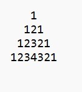

Ram is very fond of patterns. Once, his teacher gave him a pattern to solve. 
He gave Ram an integer n and asked him to build a pattern.

Help Ram build a pattern.

Constraints:
1<= n <= 10

Example 1:

Input: 4

Output:

